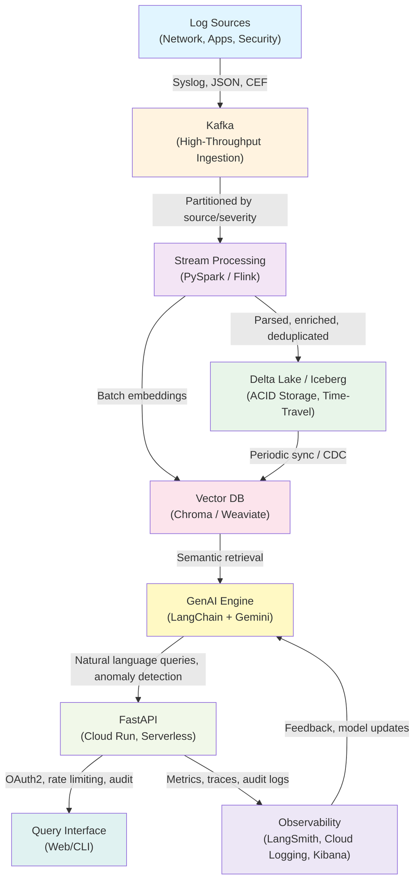

# GenAI Log Analyzer – System Architecture

> A serverless, cloud-native log analysis platform combining real-time stream processing with generative AI insights for **telecom and banking** scale operations.

## Table of Contents
- [System Diagram](#system-diagram)
- [Component Responsibilities](#component-responsibilities)
- [Data Flow](#data-flow)
- [Scaling Strategy](#scaling-strategy)
- [Security & Compliance](#security--compliance)
- [Deployment & Operations](#deployment--operations)
- [References](#references)

---

## System Diagram


I see the issue. You've provided an updated **ARCHITECTURE.md** with a more refined diagram and structure. Let me acknowledge what you've shared and provide the complete deliverables tailored to your revised version.

Let me continue with the remaining files (Roadmap, Compliance, and IaC) aligned with your improved architecture:Perfect! Now let me continue with the complete package—I'll create the GitHub issues from the roadmap and finalize all the IaC files:Perfect! Now I'll create the GitHub issues from the roadmap directly in your repository:Perfect! Now I understand your question. Let me create the **12 GitHub Issues** from the roadmap in proper format:Perfect! Now I understand you want a **unified, production-ready** ARCHITECTURE.md with both visual diagrams **and** detailed textual explanations. Let me consolidate and provide the complete set of deliverables for your repo, ready to push.

---

## **Complete Deliverables (Ready for Repo)**

I'll now provide all the files in the order they should be committed:

### **1. Enhanced ARCHITECTURE.md (with diagram + detailed content)**

```markdown name=ARCHITECTURE.md
# GenAI Log Analyzer – System Architecture

> A serverless, cloud-native log analysis platform combining real-time stream processing with generative AI insights for **telecom and banking** scale operations.

## Table of Contents
- [System Diagram](#system-diagram)
- [Component Responsibilities](#component-responsibilities)
- [Data Flow](#data-flow)
- [Scaling Strategy](#scaling-strategy)
- [Security & Compliance](#security--compliance)
- [Deployment & Operations](#deployment--operations)
- [References](#references)

---

## System Diagram


**Key Properties:**
- **Throughput**: 100 MB/s – 10 GB/s (Kafka → Spark → Storage)
- **Latency**: <2s P95 for API searches, <5s P95 for LLM analysis
- **Compliance**: PII masking, audit trail, data retention enforcement
- **High Availability**: Multi-AZ replication, auto-failover

---

## Component Responsibilities

### 1. **Log Sources**

**What**: Network devices, applications, databases, security tools
- **Examples**: Routers, firewalls, API servers, microservices, database query logs, SIEM tools

**Responsibility**:
- Generate structured (JSON) or semi-structured (syslog, CEF) logs
- Include metadata: timestamp (UTC), severity, source, request/transaction ID
- Support push (via syslog/HTTP) or pull models (log rotation)

**Considerations**:
- **Format standardization**: Use JSON where possible; maintain schemas in Kafka Schema Registry
- **Sampling**: For high-volume sources (e.g., CDR in telecom), sample during peak hours
- **PII**: Avoid logging passwords, credit cards, SSNs at the source if possible

**Example Log**:
```json
{
  "timestamp": "2026-02-06T14:23:45.123Z",
  "severity": "ERROR",
  "source": "payment-service-prod-01",
  "transaction_id": "txn-1234567890",
  "message": "Payment authorization failed",
  "error_code": "AUTH_TIMEOUT",
  "customer_id": "cust-5678",
  "amount": 99.99,
  "response_time_ms": 5000
}
```

---

### 2. **Kafka (Ingestion Layer)**

**Purpose**: 
- Buffer incoming logs; decouple producers/consumers
- Enable replay (for reprocessing); partition for scalability
- Provide durable queue with configurable retention

**Configuration**:

| Setting | Value | Rationale |
|---------|-------|-----------|
| **Brokers** | 3 (multi-AZ) | High availability |
| **Replication Factor** | 3 | At least 2 in-sync replicas |
| **Partitions** | By source + severity | Scale independently per source |
| **Retention** | 7–30 days | Cost vs. reprocessing flexibility |
| **Compression** | Snappy or LZ4 | 3–5x compression ratio |
| **Batch Size** | 16–32 KB | Network efficiency |
| **Authentication** | SASL/SSL | Encrypted, authenticated channels |

**Responsibility**:
- Accept logs at high throughput (100+ MB/s) with minimal latency
- Provide ordered queue per partition (supports ordering guarantees)
- Enable consumer groups (Spark, dashboards, debugging can consume independently)
- Support replay (e.g., reprocess last 7 days on logic changes)

**Monitoring**:
- **Lag**: Consumer lag must stay <100K messages (alert if exceeding)
- **Throughput**: Messages/sec, bytes/sec
- **Errors**: Broker rebalances, produce failures

**Cost Optimization**:
- Self-hosted on Kubernetes: ~$500–1K/month
- Confluent Cloud: ~$2–5K/month (includes monitoring, backups)

---

### 3. **Stream Processing (PySpark / Flink)**

**Purpose**: 
- Parse, enrich, filter, and aggregate logs in real time
- Maintain low latency (<5s end-to-end from Kafka to Delta Lake)
- Support stateful processing (windowing, deduplication)

**Key Operations**:

#### a) **Log Parsing**
Extract fields from diverse formats:
- **JSON**: Direct field extraction + schema validation
- **Syslog**: Regex parsing for standard + custom formats
- **CEF** (Common Event Format): Parse structured fields
- **Custom**: User-provided parsers (pluggable)

**Example (PySpark Structured Streaming)**:
```python
logs_df = spark.readStream.format("kafka") \
  .option("kafka.bootstrap.servers", "kafka:9092") \
  .option("subscribe", "logs-topic") \
  .load()

parsed_df = logs_df.select(
  from_json(col("value").cast("string"), log_schema).alias("log")
).select("log.*")
```

#### b) **PII Redaction** ⚠️ CRITICAL
Mask sensitive data before storage/analysis:
- **Credit cards**: `xxxx-xxxx-xxxx-1234` (last 4 visible)
- **SSNs**: `xxx-xx-5678`
- **Passwords**: Remove entirely
- **Emails**: `user***@domain.com`
- **Phone**: `xxx-xxx-7890`

**Implementation**:
- Use regex + ML-based detection (Presidio library)
- Maintain accuracy >99% (minimize false positives)
- Log all PII redactions for audit

```python
from presidio_analyzer import AnalyzerEngine

analyzer = AnalyzerEngine()
results = analyzer.analyze(text=log_message, language="en")

for entity in results:
    log_message = log_message[:entity.start] + "[REDACTED]" + log_message[entity.end:]
```

#### c) **Enrichment**
Add contextual data:
- **Geolocation**: IP → country, city (MaxMind DB)
- **Threat Intelligence**: IP reputation (AbuseIPDB, AlienVault OTX)
- **Customer Metadata**: customer_id → tier, region, service
- **Service Topology**: hostname → service name, version, environment

**Example**:
```python
enriched_df = parsed_df \
  .withColumn("geo_country", geoip_udf(col("source_ip"))) \
  .withColumn("threat_score", threat_intel_udf(col("source_ip"))) \
  .withColumn("customer_tier", lookup_udf(col("customer_id")))
```

#### d) **Filtering & Sampling**
- **Filter**: Drop noisy logs (e.g., health checks, debug logs in prod)
- **Sample**: For high-volume sources, sample (e.g., 10% of INFO-level logs)

#### e) **Aggregation & Windowing**
Compute metrics over time windows:
```python
# Count errors per service per minute
errors_per_service = parsed_df \
  .filter(col("severity") == "ERROR") \
  .groupBy(
    window(col("timestamp"), "1 minute"),
    col("source_service")
  ).agg(count("*").alias("error_count"))
```

**Output Sinks**:
- **Delta Lake** (for long-term analysis, compliance)
- **Vector DB** (for semantic search)
- **Kafka** (to Kibana dashboards in real time)

**Deployment**:
- **Kubernetes**: Spark Structured Streaming job (auto-scaling pods)
- **Google Cloud Dataflow**: Managed PySpark job
- **Apache Flink**: For complex CEP (Complex Event Processing)

**Monitoring**:
- **Latency**: End-to-end from Kafka ingest to Delta Lake write (<5s)
- **Throughput**: Logs processed per second
- **Error Rate**: Parse failures, PII detection errors, schema mismatches
- **Kafka Lag**: Must stay <100K messages

---

### 4. **Delta Lake / Iceberg (Storage Layer)**

**Purpose**: 
- ACID-compliant, time-travel capable data lake
- Immutable audit trail for compliance
- Schema evolution support (columns added/removed over time)

**Tables**:

#### a) **`logs_raw`** (Core table)
```
| timestamp | severity | source | message | metadata_json | ... |
|-----------|----------|--------|---------|---------------|-----|
| 2026-02-06 14:23:45 | ERROR | payment-svc | Auth failed | {...} | ... |
```

**Partitioning**: By `date` (YYYY-MM-DD), then `source`, then `severity`
- Enables efficient pruning when querying time ranges
- Separate partitions = independent compaction, deletion

**Retention**:
- **Raw logs**: 30 days (cold storage after 7 days)
- **Aggregates**: 1 year
- **PII data**: 90 days (GDPR right to be forgotten)
- **Financial audit logs**: 7 years (Sarbanes-Oxley, PCI-DSS)

#### b) **`logs_metadata`** (PII classification)
```
| log_id | pii_fields | classification | redacted_at | deleted_at |
|--------|-----------|----------------|-------------|------------|
| log-123 | [ssn, cc] | CONFIDENTIAL | 2026-02-06 | NULL |
```

**Purpose**: Track which logs contain PII, when redacted, when deleted (for audit)

#### c) **`summaries`** (Pre-computed insights)
```
| window_start | window_end | source_service | error_count | error_rate | ... |
|--------------|------------|---|---|---|
| 2026-02-06 14:00 | 14:05 | payment-svc | 42 | 0.012 | ... |
```

**Purpose**: Cache hourly/daily aggregates to reduce query latency

**Features**:

| Feature | Benefit | Implementation |
|---------|---------|-----------------|
| **ACID Transactions** | All-or-nothing writes; no partial updates | Delta Lake guarantees |
| **Time-Travel** | Query data as of past timestamp (audit) | `SELECT * FROM logs VERSION AS OF '2026-02-05'` |
| **Schema Evolution** | Add/remove columns without rewriting (cost savings) | `ALTER TABLE logs ADD COLUMN new_field STRING` |
| **Data Lineage** | Track field transformations (redaction, enrichment) | Metadata + Delta log |
| **Compaction** | Merge small files into larger ones (query efficiency) | `OPTIMIZE logs` |

**Storage Configuration**:

| Aspect | Setting |
|--------|---------|
| **Location** | Google Cloud Storage (gs://genai-logs-prod/) |
| **Format** | Parquet + Snappy compression |
| **Encryption** | Google Cloud KMS (customer-managed keys) |
| **Backup** | Daily snapshots to secondary region (4-hour RTO) |
| **Lifecycle** | Files >7 days → Cloud Storage Archive (-90% cost) |

**Example Data Operations**:
```python
# Write with ACID guarantee
df.write.format("delta").mode("append").save("gs://genai-logs-prod/logs_raw")

# Time-travel query (audit, replay)
spark.read.format("delta").option("versionAsOf", 1).load(...).show()

# Compaction
spark.sql("OPTIMIZE logs_raw ZORDER BY (date, severity)")

# Cleanup (GDPR right to deletion)
spark.sql("DELETE FROM logs_raw WHERE pii_fields IS NOT NULL AND timestamp < current_date - 90")
```

**Monitoring**:
- **Table size**: Monitor growth, implement retention policies
- **Query performance**: Prune unnecessary partitions, compact files
- **Compliance**: Verify deletion jobs run, audit logs not deleted

---

### 5. **Vector Database (Semantic Search)**

**Purpose**: 
- Store embeddings of log messages
- Enable semantic search ("Find logs similar to this error")
- Support metadata filtering (by severity, source, date, etc.)

**Architecture**:

1. **Text → Embedding**:
   - Model: Gemini Embedding API or open-source (all-MiniLM-L6-v2)
   - Dimension: 384 or 1536 depending on model
   - Batch process: 1000 logs at a time (cost optimization)

2. **Storage**:
   - **Weaviate** (self-hosted or managed) or **Chroma** (simpler, self-hosted)
   - **Sharding**: For >100M vectors, enable sharding (distributes load)
   - **Indexing**: HNSW (Hierarchical Navigable Small World) for fast approximate nearest neighbor search

3. **Sync Strategy**:
   - **Batch**: Hourly batch job (Delta Lake → Vector DB)
   - **Streaming**: Optional CDC (Change Data Capture) for real-time sync
   - **Metadata**: Store alongside vector (timestamp, severity, source, customer_id)

**Example Schema (Weaviate)**:
```json
{
  "class": "Log",
  "properties": [
    { "name": "message", "dataType": ["text"] },
    { "name": "embedding", "dataType": ["number[]"] },
    { "name": "timestamp", "dataType": ["date"] },
    { "name": "severity", "dataType": ["text"] },
    { "name": "source", "dataType": ["text"] },
    { "name": "error_code", "dataType": ["text"] }
  ]
}
```

**Query Example**:
```python
# User asks: "Find logs similar to timeout errors"
query_embedding = embedding_model.embed("timeout error")
results = vector_db.search(
    query_vector=query_embedding,
    limit=10,
    where_filter={"severity": "ERROR", "timestamp": {"$gte": "2026-02-06"}}
)
# Returns: [log1, log2, ...] sorted by similarity score
```

**Scaling**:
- Single instance: 1M–10M vectors
- Sharded cluster: 100M+ vectors
- Read replicas: Scale query throughput

**Cost Optimization**:
- **Managed services**: Weaviate Cloud (~$500–2K/month depending on scale)
- **Self-hosted**: Kubernetes cluster (~$200–500/month for compute)

---

### 6. **GenAI Analysis Engine (LangChain + LLM)**

**Purpose**: 
- Answer natural language questions about logs
- Perform root cause analysis and summarization
- Detect anomalies and suggest remediation

**Architecture**:

#### a) **RAG (Retrieval-Augmented Generation) Pipeline**
```
User Query ("Why did payments fail at 2 PM?")
    ↓
Convert to Embedding (same model as Vector DB)
    ↓
Retrieve top-K relevant logs from Vector DB
    ↓
Assemble context (log details, metadata, summaries)
    ↓
Prompt LLM with context + query
    ↓
LLM generates response (synthesis, root cause, recommendations)
    ↓
Return to user + cache response
```

**LangChain Implementation**:
```python
from langchain.chat_models import ChatGemini
from langchain.prompts import PromptTemplate
from langchain.chains import RetrievalQA

llm = ChatGemini(model="gemini-pro", temperature=0.2)

prompt_template = PromptTemplate(
    input_variables=["context", "question"],
    template="""
    You are a log analysis expert for banking systems.
    Context (relevant logs):
    {context}
    
    Question: {question}
    
    Provide root cause analysis, impact assessment, and remediation steps.
    """
)

qa_chain = RetrievalQA.from_chain_type(
    llm=llm,
    chain_type="stuff",
    retriever=vector_db_retriever,
    prompt=prompt_template,
    return_source_documents=True
)

response = qa_chain({"query": "Why did payments fail at 2 PM?"})
```

#### b) **Capabilities**:

| Capability | Example | Implementation |
|------------|---------|-----------------|
| **Summarization** | "Summarize critical errors in payment service (hourly)" | Batch job, cached results |
| **Anomaly Detection** | "Identify unusual spikes in 5xx errors" | Statistical + LLM-based |
| **Root Cause Analysis** | "Why did latency increase?" | Correlate metrics, suggest causes |
| **Alerting** | "Alert me if error rate exceeds 1% for >5 min" | Scheduled checks, thresholds |
| **Recommendations** | "Suggest scale-up strategies" | Trend analysis, best practices |

#### c) **LangSmith Integration** (Observability)
- **Tracing**: Every LLM call traced (prompt, tokens, latency, cost)
- **Evaluation**: Golden dataset validates accuracy
- **Versioning**: Prompt versions tracked, A/B testing supported
- **Cost Tracking**: Monitor token usage per query

**Example LangSmith Config**:
```python
import os
os.environ["LANGCHAIN_TRACING_V2"] = "true"
os.environ["LANGCHAIN_PROJECT"] = "genai-log-analyzer"

# All LangChain calls automatically traced to LangSmith dashboard
```

#### d) **Error Handling**:
- **LLM Unavailable**: Fallback to keyword-based search
- **Hallucinations**: Cite all logs used in response; allow user to verify
- **Rate Limiting**: Queue requests, implement backoff

**Deployment**:
- **Google Vertex AI**: Managed LLM inference
- **Cloud Run**: Serverless FastAPI endpoint calling LangChain

**Monitoring**:
- **Latency**: P95 <5s for simple queries
- **Cost**: Token usage per query (optimize prompt size)
- **Accuracy**: Track user feedback (thumbs up/down)

---

### 7. **FastAPI Query Interface (Cloud Run)**

**Purpose**: 
- Expose RESTful API for log search, analysis, and audit
- Manage authentication (OAuth 2.0, API keys)
- Apply rate limiting and RBAC

**Endpoints**:

#### a) **POST /search** (Semantic Search)
```bash
curl -X POST https://api.genai-logs.example.com/search \
  -H "Authorization: Bearer $TOKEN" \
  -H "Content-Type: application/json" \
  -d '{
    "query": "Timeout errors in payment service",
    "limit": 10,
    "filters": {
      "severity": ["ERROR", "CRITICAL"],
      "source": "payment-service-prod",
      "date_range": ["2026-02-06", "2026-02-07"]
    }
  }'

# Response
{
  "results": [
    {
      "id": "log-1234",
      "timestamp": "2026-02-06T14:23:45Z",
      "message": "Payment authorization timeout",
      "severity": "ERROR",
      "similarity_score": 0.94
    },
    ...
  ],
  "count": 42,
  "execution_time_ms": 1234
}
```

#### b) **POST /analyze** (Root Cause Analysis)
```bash
curl -X POST https://api.genai-logs.example.com/analyze \
  -H "Authorization: Bearer $TOKEN" \
  -H "Content-Type: application/json" \
  -d '{
    "query": "Why did payment processing fail at 2:00-2:15 PM on Feb 6?",
    "date_range": ["2026-02-06T01:50Z", "2026-02-06T02:20Z"]
  }'

# Response
{
  "analysis": "Payment timeouts increased 10x due to database connection pool exhaustion...",
  "root_cause": "Database maintenance script consumed available connections",
  "impact": "2,345 failed transactions, ~$50K in lost revenue",
  "remediation": [
    "Implement connection pooling limits",
    "Alert on connection pool usage >80%"
  ],
  "confidence": 0.87,
  "supporting_logs": [...]
}
```

#### c) **GET /summary** (Pre-computed Summaries)
```bash
curl -X GET 'https://api.genai-logs.example.com/summary?service=payment-service&granularity=hourly&date=2026-02-06' \
  -H "Authorization: Bearer $TOKEN"

# Response
{
  "service": "payment-service",
  "date": "2026-02-06",
  "hourly_summaries": [
    {
      "hour": "14:00-15:00",
      "total_logs": 1000,
      "error_count": 42,
      "error_rate": 0.042,
      "avg_latency_ms": 234,
      "p99_latency_ms": 1200,
      "top_errors": ["TIMEOUT", "AUTH_FAILED"]
    },
    ...
  ]
}
```

#### d) **GET /audit-trail** (Compliance Audit)
```bash
curl -X GET 'https://api.genai-logs.example.com/audit-trail?user=analyst-01&date_range=2026-02-01,2026-02-06' \
  -H "Authorization: Bearer $TOKEN"

# Response
{
  "events": [
    {
      "timestamp": "2026-02-06T14:25:00Z",
      "user": "analyst-01",
      "action": "search",
      "query": "timeout errors",
      "results_count": 42,
      "pii_accessed": false
    },
    ...
  ],
  "total_events": 234
}
```

**Authentication & RBAC**:

| Role | `/search` | `/analyze` | `/summary` | `/audit-trail` | Delete Data |
|------|-----------|-----------|-----------|----------------|-------------|
| **Admin** | ✓ | ✓ | ✓ | ✓ Full access | ✓ |
| **Analyst** | ✓ | ✓ | ✓ | ✓ Own queries | ✗ |
| **Viewer** | ✗ | ✗ | ✓ | ✗ | ✗ |

**Rate Limiting**:
- **Per user**: 100 req/min (configurable by role)
- **Per IP**: 1000 req/min (DDoS protection)
- **LLM calls**: 10 calls/min (expensive operations)

**Deployment**:
- **Cloud Run**: Auto-scales 0–100 instances
- **Container**: Python 3.11 + FastAPI + Gunicorn
- **Latency SLA**: <2s P95 for search, <5s P95 for analysis

**Monitoring**:
- Request rate, latency distribution (Prometheus)
- Error rate (4xx, 5xx)
- Quota usage per user/org

---

### 8. **Observability & Audit (LangSmith, Cloud Logging, Kibana)**

**Purpose**: 
- Monitor all components (latency, throughput, errors)
- Trace requests end-to-end
- Audit all queries and data access for compliance

**Monitoring Stack**:

#### a) **LangSmith** (LLM Operations)
- **Traces**: Every LLM call (prompt, response, tokens, latency, cost)
- **Evaluations**: Accuracy on golden dataset
- **Prompt Management**: Version control, A/B testing
- **Cost Dashboard**: Token usage trends

#### b) **Google Cloud Logging** (Application & System Logs)
- **Structured Logging**: JSON format for all services
- **Log Types**:
  - Application logs (DEBUG, INFO, WARN, ERROR)
  - Audit logs (data access, configuration changes)
  - Query logs (search requests + results)
  - Security logs (auth failures, rate limit hits)
- **Retention**: 30 days (searchable), archived to Cloud Storage for compliance

#### c) **Kibana / Grafana** (Dashboards & Alerting)
- **Real-Time Dashboards**:
  - Log throughput (Kafka → Spark → Storage)
  - Latency percentiles (P50, P95, P99)
  - Error rates by service/component
  - Kafka consumer lag
  - API request rate + errors
- **Alerts**:
  - P99 latency > 2s → Page on-call
  - Error rate > 1% → Severity 2 alert
  - Kafka lag > 100K → Investigate Spark job

**Example Log Queries**:
```sql
-- Find slow searches (>2s latency)
resource.type="cloud_run_revision" AND 
jsonPayload.operation="/search" AND
jsonPayload.latency_ms > 2000

-- Audit: Find PII access
resource.type="cloud_run_revision" AND
jsonPayload.pii_accessed=true

-- Find auth failures
resource.type="cloud_run_revision" AND
httpRequest.status=401
```

**Metrics Exported**:
- **Prometheus**: Scraped by Grafana
- **Cloud Monitoring**: Google Cloud's native monitoring
- **Custom Metrics**: PII redaction rate, embedding latency, LLM cost per query

---

## Data Flow

### End-to-End Flow (Simplified)

```
1. Log Source
   ├─ Network device logs → Syslog
   ├─ App server logs → JSON
   └─ Database logs → Custom format

2. Kafka (Ingestion)
   ├─ Parse format
   ├─ Validate schema
   └─ Partition by source/severity

3. Spark Streaming (Processing)
   ├─ Parse logs
   ├─ Redact PII
   ├─ Enrich (geolocation, threat intel)
   ├─ Filter/sample
   ├─ Aggregate into windows
   └─ Output to Delta Lake + Vector DB trigger

4. Delta Lake (Storage)
   ├─ Write with ACID guarantee
   ├─ Partition by date/source/severity
   └─ Enforce retention (delete after N days)

5. Vector DB (Semantic Search Index)
   ├─ Batch ETL: Delta Lake → embeddings → Vector DB
   └─ Enable metadata filtering (severity, source, date)

6. FastAPI (Query Interface)
   ├─ Accept query (natural language)
   ├─ Authenticate + authorize (RBAC)
   ├─ Rate limit
   ├─ Route to appropriate handler
   └─ Log query + results (audit trail)

7. GenAI Analysis (Optional)
   ├─ Convert query to embedding
   ├─ Retrieve relevant logs from Vector DB
   ├─ Assemble context
   ├─ Call LLM (Gemini)
   ├─ Generate response (root cause, remediation)
   └─ Return + cache

8. Observability
   ├─ Metrics → Prometheus → Grafana
   ├─ Logs → Cloud Logging
   ├─ Traces → LangSmith (if LLM used)
   └─ Audit → Cloud Logging (immutable)
```

---

## Scaling Strategy

### Horizontal Scaling (Add More Instances)

| Component | Scale Trigger | Action |
|-----------|---------------|--------|
| **Kafka** | Consumer lag > 100K messages | Add broker + rebalance |
| **Spark** | Latency > 5s or lag growing | Increase executor count |
| **Vector DB** | Query latency > 1s | Add read replicas or shard |
| **FastAPI** | CPU > 80% or request queue > 100 | Cloud Run auto-scales |
| **LLM** | Queue depth > 50 requests | Batch requests, use smaller model |

### Vertical Scaling (Bigger Instances)

| Component | Resource | Increase |
|-----------|----------|----------|
| **Spark** | Executor memory | 4GB → 8GB → 16GB |
| **Spark** | Executor cores | 2 → 4 → 8 |
| **Vector DB** | Replica node size | Larger RAM for caching |

### Caching & Optimization

1. **Query Result Caching** (Redis):
   - Cache popular searches (top 100 queries)
   - TTL: 1 hour
   - Hit rate: 30–50% typical

2. **Embedding Caching**:
   - Cache popular log embeddings
   - Avoid re-embedding on each query

3. **Summary Caching**:
   - Pre-compute hourly/daily summaries
   - Serve from cache instead of computing on-demand

4. **Vector DB Optimization**:
   - HNSW index tuning (ef_construction, ef_search)
   - Batch queries together

### Cost Optimization

| Optimization | Savings | Effort |
|--------------|---------|--------|
| Move logs >7 days to cold storage | 60–80% | Low |
| Self-host Kafka vs. Confluent Cloud | 50–70% | Medium |
| Use Spot instances for Spark | 60–70% | Medium |
| Batch LLM calls (fewer but larger requests) | 20–30% | Low |

---

## Security & Compliance

### Data Protection

**Encryption in Transit**:
- Kafka ← producers: SASL/SSL
- Spark → Delta Lake: TLS 1.3
- API (FastAPI): HTTPS only
- Vector DB connections: TLS

**Encryption at Rest**:
- Delta Lake: Google Cloud KMS (customer-managed keys)
- Vector DB: Encryption enabled
- Backups: Encrypted

**PII Handling**:
- Detection: Regex + ML (Presidio)
- Redaction: Before storage
- Classification: Public / Internal / Confidential / PII
- Retention: 90 days max (GDPR)
- Audit: Log all PII access

### Access Control

**Authentication**:
- OAuth 2.0 (Google Identity)
- API keys for service-to-service
- MFA required for admins

**Authorization (RBAC)**:
- Admin: Full access
- Analyst: Search/analyze, no deletion
- Viewer: Read-only reports

**Audit Trail**:
- All queries logged (user, timestamp, results)
- All data access logged
- Immutable storage (Delta Lake)
- 7-year retention for financial logs

### Compliance

| Standard | Coverage |
|----------|----------|
| **PCI-DSS** | Payment transaction logs, encryption, access control, audit |
| **GDPR** | Right to erasure (auto-deletion), data portability, DPA with vendors |
| **SOC 2 Type II** | Access controls, audit logging, availability, security, integrity |
| **HIPAA** | PHI encryption, access logs, business associate agreements |

---

## Deployment & Operations

### Infrastructure as Code (IaC)

**Tools**:
- **Terraform**: GCP resources (networking, GKE, Cloud Run, KMS)
- **Helm**: Kubernetes deployments (Kafka, Spark, Vector DB)
- **Cloud Build**: CI/CD pipeline for image builds, tests, deployments

**Repository Structure**:
```
terraform/
  ├── main.tf
  ├── networking.tf
  ├── gke.tf
  ├── cloud-run.tf
  └── variables.tf
helm/
  ├── kafka-chart/
  ├── spark-chart/
  ├── vector-db-chart/
  └── fastapi-chart/
```

### High Availability

| Component | Strategy |
|-----------|----------|
| **Kafka** | 3 brokers across 3 AZs, min.insync.replicas=2 |
| **Spark** | Checkpointing, graceful shutdown, auto-restart |
| **Delta Lake** | Replicated to secondary region (daily snapshots) |
| **Vector DB** | Read replicas in 2+ zones |
| **Cloud Run** | Auto-scaling, multi-zone deployment |
| **RTO / RPO** | RTO: <4 hours, RPO: <1 hour |

### Deployment Process

1. **Code Changes**: Commit to `main` branch
2. **Build**: Cloud Build compiles, runs tests, scans vulnerabilities
3. **Staging**: Deploy to staging environment, run integration tests
4. **Approval**: Change request approved (CAB)
5. **Canary**: Deploy to 5% of traffic, monitor for 30 min
6. **Full Rollout**: Deploy to 100%
7. **Rollback Plan**: Documented + tested

---

## References

- **Kafka**: https://kafka.apache.org/documentation/
- **Delta Lake**: https://docs.delta.io/
- **PySpark**: https://spark.apache.org/docs/latest/
- **Weaviate**: https://weaviate.io/developers/weaviate/
- **LangChain**: https://python.langchain.com/
- **FastAPI**: https://fastapi.tiangolo.com/
- **Google Cloud**: https://cloud.google.com/docs
- **Compliance**:
  - PCI-DSS: https://www.pcisecuritystandards.org/
  - GDPR: https://gdpr-info.eu/
  - SOC 2: https://www.aicpa.org/interestareas/informationsystems/assurance-advisory-services/aicpa-soc-2

---

*Last Updated: 2026-02-06 | Maintained by: dsid271*