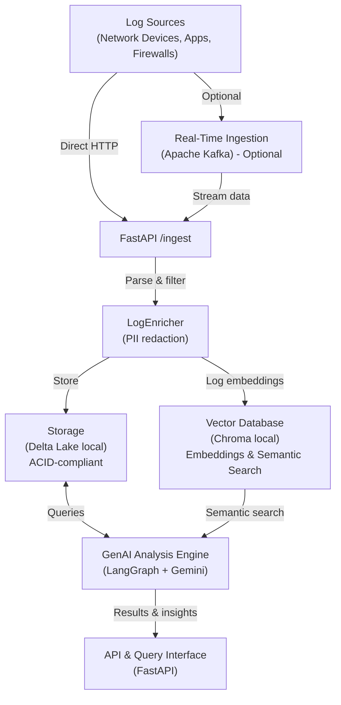

# Serverless-GenAI-Log-Analyzer

### Abstract

This project demonstrates the development and deployment of a cloud-native, serverless API designed to serve as a **Generative AI-powered Network Log Analyzer**. The core objective was to build an end-to-end, production-ready system that showcases expertise in modern software engineering and machine learning operations (**MLOps**).

The system architecture features a **FastAPI** backend that orchestrates the **Gemini API** via **LangChain** to process and summarize complex network logs. To ensure a robust and scalable solution, the application is containerized with **Docker** and deployed on **Google Cloud Run**, a serverless platform that aligns with cloud-native principles.

A key component of this project is the fully automated **Continuous Integration (CI)** pipeline, implemented with **GitHub Actions**. This workflow automatically runs linting and smoke tests, and publishes a Docker image to the GitHub Container Registry (GHCR) with every code change. Continuous Deployment (CD) to Cloud Run is a planned future enhancement.

This project goes beyond a simple proof of concept, serving as a comprehensive demonstration of skills in **containerization, MLOps, CI/CD, and the application of Generative AI** in a practical, real-world context.

Note: _This repo currently implements a lightweight, serverless FastAPI service with modular plugins (connectors/detectors/analyzers). Spark/Flink are part of the **future scale-out plan** and are not implemented in this codebase yet._

## Implemented Now (MVP)

- **FastAPI API** with `GET /`, `POST /ingest`, `POST /analyze`, `GET /plugins`, `GET /incidents`, `POST /search`, `GET /summary`, `GET /audit-trail`
- **Modular plugin system** via `ENABLED_CONNECTORS`, `ENABLED_DETECTORS`, `ENABLED_ANALYZERS`
- **Plugin loading** via `PLUGIN_MODULES` (derived-image friendly)
- **Proactive detection** (`error_spike`) and **incident store** with attached analyzer outputs
- **Docker module sets** (`MODULE_SET=minimal|full`) for lightweight base images

## System Architecture



*(Note: See [ARCHITECTURE.md](./ARCHITECTURE.md) for the planned future scale-out architecture featuring Spark/Flink and managed cloud services.)*

## Key Features

- **Modular DI**: All core components (redactor, storage, vector store, engine) are injected via constructor with automatic null fallbacks.
- **Scalable path**: designed to scale out to Kafka + Spark/Flink for terabytes/day (future)
- **Secure**: PII masking, RBAC (via API Keys), and structured audit logging.
- **Compliant**: Append-only storage, audit trails, data lineage (banking/telecom)
- **Intelligent**: Natural language queries, anomaly detection, summarization via a LangGraph Agentic workflow.
- **Serverless Ready**: Designed for auto-scaling FastAPI on Cloud Run; minimal ops overhead

---

## Architecture Overview

See [ARCHITECTURE.md](./ARCHITECTURE.md) for detailed component responsibilities, data flow, scaling strategies, and security controls.

---

## Quick Start

### 1. Installation
This project uses `uv` for lightning-fast dependency management.
```powershell
uv sync
uv run python -m spacy download en_core_web_sm
```

### 2. Environment Setup
Copy the example environment file and fill in your keys (a `GEMINI_API_KEY` is required for the LLM analyzer to work):
```powershell
cp .env.example .env
```
Ensure your `.env` has the necessary values:
```env
GEMINI_API_KEY=your_key_here
LANGCHAIN_TRACING_V2=true
LANGCHAIN_API_KEY=your_langchain_api_key_here
KAFKA_BOOTSTRAP_SERVERS=localhost:9092
LOG_TOPIC=logs-raw
VECTOR_DB_TYPE=chroma
CHROMA_PATH=./data/chroma
DELTA_LAKE_PATH=./data/delta-lake
ENABLE_AUTH=false
API_KEYS_FILE=./api/api_keys.yaml
```

### 3. Running the API
```powershell
uv run uvicorn api.main:app --reload
```

---

## Docker (Plug-and-Play)

This project can be built as a single container image that clients can run locally and then deploy to Cloud Run.

### Build-time modularity (Docker build args)

The Dockerfile supports a module-set switch:

```powershell
docker build -t genai-log-analyzer --build-arg MODULE_SET=minimal .
```

- **`MODULE_SET=minimal`**: boots the API with null fallbacks (no Kafka/vector/PII/LLM dependencies).
- **`MODULE_SET=full`**: includes the full dependency set.

The module-set requirements live under:
- `requirements/minimal.txt`
- `requirements/full.txt`

### Runtime modularity (env vars)

Modules are activated at runtime via env vars:

- **`ENABLED_CONNECTORS`**: `kafka`
- **`ENABLED_DETECTORS`**: `error_spike`
- **`ENABLED_ANALYZERS`**: `simple_summary`

Plugin loading:
- **`PLUGINS_DIR`**: directory added to `sys.path` for plugin modules (default: `/app/plugins`)
- **`PLUGIN_MODULES`**: comma-separated Python module names to import; each module may define `register(registry)`

Example (run detector + analyzer locally):

```powershell
docker run -p 8001:8000 \
  -e ENABLED_DETECTORS=error_spike \
  -e ENABLED_ANALYZERS=simple_summary \
  -e ERROR_SPIKE_THRESHOLD=5 \
  genai-log-analyzer
```

Validation endpoints:
- `GET /plugins`
- `GET /incidents`

### Proactive detector tuning (error spike)

The built-in `error_spike` detector raises an incident when it sees a spike of `ERROR`/`CRITICAL` logs.

Env vars:
- **`ERROR_SPIKE_THRESHOLD`**: number of error events required to raise an incident
- **`ERROR_SPIKE_WINDOW_SECONDS`**: sliding window for counting errors
- **`ERROR_SPIKE_COOLDOWN_SECONDS`**: minimum seconds between incidents (dedup); set to `0` to disable cooldown

### Incident analyzers

Analyzers run only when an incident is raised (to keep cost low). Enable them via `ENABLED_ANALYZERS`.

Built-ins:
- **`simple_summary`**: lightweight deterministic summary (no external deps)
- **`gemini_triage`**: optional LLM triage output (requires `GEMINI_API_KEY` and full deps)

### Extending with client modules (derived image)

Clients can extend the base image by building a derived image:

```dockerfile
FROM genai-log-analyzer:latest
COPY client_plugins/ /app/plugins/
ENV PLUGIN_MODULES=client_plugin_entry
```

The module entry must expose a callable `register(registry)` function.

This repo includes an example plugin module you can load immediately:
- `plugins/example_client_module.py` (registers analyzer `client_tag`)

Run it locally:

```powershell
docker run -p 8001:8000 \
  -e ENABLED_DETECTORS=error_spike \
  -e ENABLED_ANALYZERS=simple_summary,client_tag \
  -e PLUGIN_MODULES=example_client_module \
  -e ERROR_SPIKE_THRESHOLD=5 \
  genai-log-analyzer
```

---

## Dependency management note (uv vs Docker)

- **Local dev** uses `pyproject.toml` via `uv`.
- **Docker builds** use `requirements/<MODULE_SET>.txt` to keep images lightweight.

---

## Advanced PII Redaction

The system uses a **Profile-Driven Hybrid Redaction Engine**. This allows it to adapt to different industries (Financial, Medical, etc.) without code changes.

### Configuration (`processing/pii_profiles.yaml`)
> [!NOTE]
> The included `pii_profiles.yaml` serves as a **template and example**. In a real production environment, this should be expanded with specialized patterns (SSNs, Passport IDs, etc.) relevant to the client's industry.

You can define entities, confidence thresholds, and custom Regex patterns in the profiles file:
```yaml
profiles:
  financial:
    entities: ["CREDIT_CARD", "PHONE_NUMBER", "EMAIL_ADDRESS"]
    custom_recognizers:
      - name: "cc_pattern"
        regex: "\\b(?:\\d[ -]*?){13,16}\\b"
        score: 0.8
```

### Deployment Customization (The "Tech Guy" Option)
Clients can inject their own PII rules at runtime using Docker volumes. No rebuilding required:
```yaml
# docker-compose.yml example
services:
  api:
    volumes:
      - ./my_custom_profiles.yaml:/app/processing/pii_profiles.yaml
```

---

## Real-Time Ingestion (Kafka)

The system includes an asynchronous Kafka consumer that processes logs at scale.

- **Background Worker**: Managed via FastAPI `lifespan` events.
- **Fail-Safe**: The API remains operational even if the Kafka broker is offline (Graceful Degradation).
- **Manual Ingestion**: A `/ingest` POST endpoint is available for batch log uploads.

To test the consumer locally:
1. Start Kafka via Docker: `docker compose up -d`
2. Run the API (Consumer starts automatically): `uv run uvicorn api.main:app --reload`

---

## Testing the Redactor
Run the included test suite to verify different profiles:
```powershell
uv run test_redactor.py
```
